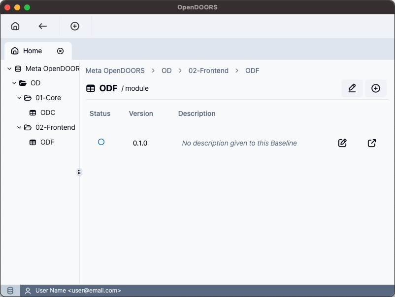

[](https://github.com/marcusvinoli/open-doors/actions/workflows/main.yml)

**Open-doors** is an open-source requirements management tool designed for capturing, tracking, and managing requirements. This application leverages a distributed, object-oriented approach to handle complex requirement specifications efficiently. 

Storing objects in YAML format and using Git for change tracking, ensuring traceability and flexibility, open-doors supports Markdown for text formatting, links between objects and custom attributes.
  
> ### <span style="color: #c03534; margin: 1em 0;"> HEADS UP! This is a very experimental tool. Use carefully and be kind reporting issues.</span>

## Features

These features are currently supported on open-doors: 

- **File-Structure Hierarchy:** open-doors provides a structured hierarchy to efficiently organize folders, formal modules, and projects, making it easy to manage complex requirements.

- **Object Linking:** Create and manage links between related objects, ensuring traceability and a clear understanding of dependencies.

- **Custom Attributes:** Define custom attributes for your requirements, supporting string, string list, and boolean types to tailor the system to your project's specific needs.

- **Markdown Support:** Integrate and render Markdown content within your requirements to enhance documentation with rich text formatting.

### Coming soon
We are working on these features to include as soon as possible (_not necessarily in this exact order_): 

- **Full and Automated Git Support:** currently, open-doors only is capable of staging changes for us. All the git handling ("Commiting, pushing, pulling, etc...) must be done manualy using a terminal or other tool.

- **Unique ID across the whole repository:** The current object enumerating strategy follows the local copy of repository for enumerating itens. Soon this strategy will change to prevent duplicated objects.

- **Baseline Definition:** The baselines uses git tags for commiting a group of objects, consolidating those changes in a version. Soon, this feature will be fully integrated to open-doors.

- **Traceability Matrix:** One of the most important tool provided by any requirements management tool, that is used to track all the product specifications compliance.

- **Import/Export:** Soon, you will be able to export the modules as a HTML, CSV, TSV, or as the most commom spreadsheet files. Also you will be able import them from a vas majority of documents.

- **Database Connection:** Although the purpose of open-doors is to use a Git Server, and rely on YAML docs saved locally on file system, a database may provide a lot of convenience and enable simultaneous work on a same module.

## Screenshots

Take a look on how this application looks like.





## Developing

If you are an enthusiast of Svelte, Rust, TS and some other "indie technology", join us! Any contribution is welcome! Any contribution is welcome (_including complaining about a bug when opening an issue_).


## Building

Build might be tricky if you don't have already cargo installed, neither node + npm. Make sure you have [Rust](https://www.rust-lang.org/learn/get-started) and [NodeJS](https://nodejs.org/) before everything. First, install all dependencies: 

```bash
npm install
```
Then, run:
```bash
npm run tauri build
```

## Keep in Touch

I am not a "professional programmer", but this app gets its basic job done honestfully. Remember that is was born from a Hobby. Therefore bugs, inconsistencies, SOLID and Clean-Code principles transgressions... But I appreciate advices and feedbacks. You can send-me an [e-mail](mailto:marcusvinoli@gmail.com) ou find me on my [LinkedIn](https://linkedin.com/in/marcusvinoli)
